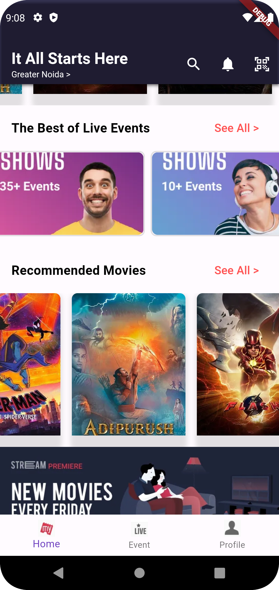

# BookMyShow Flutter UI

This repository contains a Flutter UI implementation of the BookMyShow app. The UI design focuses on creating a modern and user-friendly interface for browsing and booking movie tickets, as well as exploring live events.

## Features
- Explore recommended movies and events
- Intuitive navigation with a customized bottom navigation bar
- Elegant and responsive design for a seamless user experience
- Easy booking process for movie tickets and event registrations

## Screenshots

## Getting Started
1. Clone the repository
2. Open the project in Flutter IDE
3. Run the app on your preferred device or emulator

## Dependencies
- Flutter 2.0 or higher
- Dart 2.12 or higher

## Contributions
Contributions are welcome! If you encounter any issues or have suggestions for improvements, please feel free to open an issue or submit a pull request.

## License
This project is licensed under the [MIT License](LICENSE). Feel free to use and modify the code as per your requirements.

## Acknowledgments
Special thanks to the Flutter community for their valuable resources and inspiration in creating this UI.

- [Lab: Write your first Flutter app](https://docs.flutter.dev/get-started/codelab)
- [Cookbook: Useful Flutter samples](https://docs.flutter.dev/cookbook)

For help getting started with Flutter development, view the
[online documentation](https://docs.flutter.dev/), which offers tutorials,
samples, guidance on mobile development, and a full API reference.
